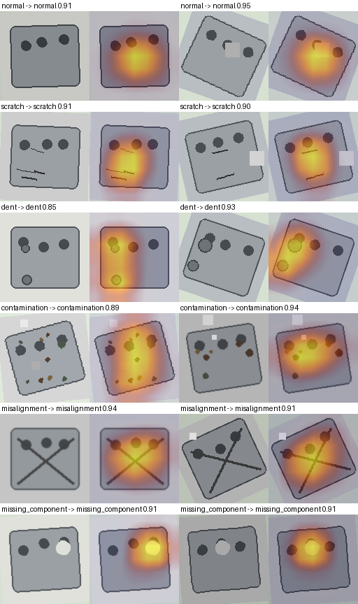
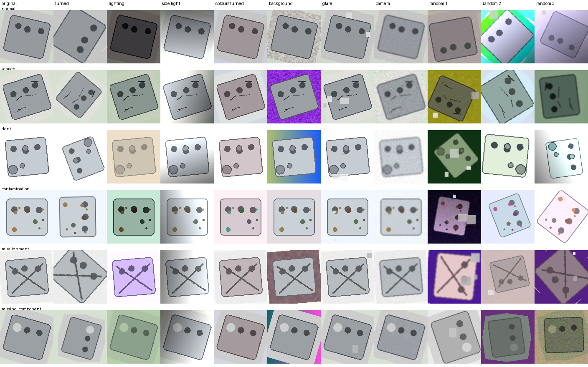
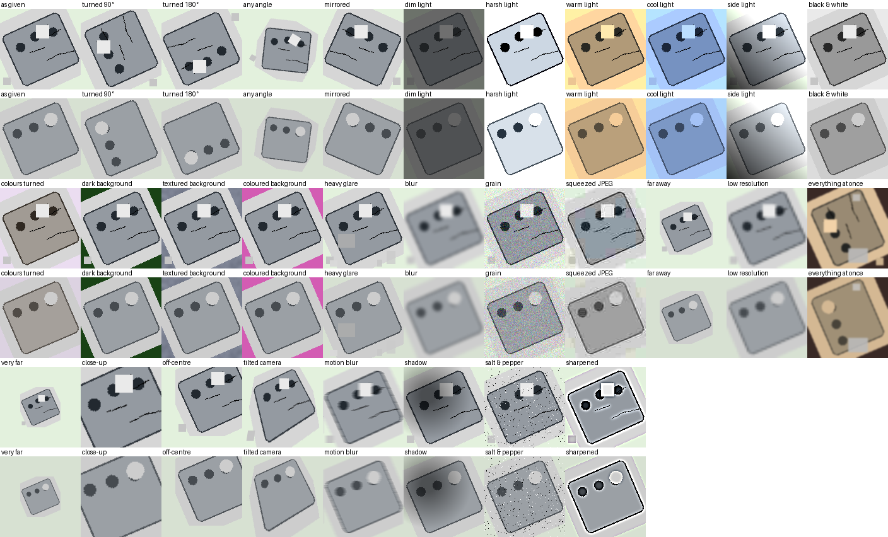

# DefectLens — robust visual defect inspection

> Built in eight hours at **AI ARENA 2026**, the AI/ML hackathon of **DRESTEIN'26** — the 17th
> National Level Intercollegiate Technical and Management Fest of **Saveetha Engineering College
> (SEC), Chennai**, presented by its Department of Artificial Intelligence and Machine Learning.
>
> **DefectLens track · Team 18 · Sri Manakula Vinayagar Engineering College (SMVEC), Puducherry.**
>
> Challenge and data: [sanjai-umashankar/AI-Arena-AIML-Hackathon-2026](https://github.com/sanjai-umashankar/AI-Arena-AIML-Hackathon-2026)

An inspection station for factory parts. Give it a photo and it answers **PASS**, **REJECT** (and
which defect) or **REVIEW** (not sure — a person should look), and shows a heat-map of where on the
part it looked. Six classes: `normal`, `scratch`, `dent`, `contamination`, `misalignment`,
`missing_component`.



**The challenge:** the organisers warned that new photos would change "lighting, orientation,
backgrounds and defect presentation". So the task is not to score well on the photos we were given
— that turned out to be easy — but to keep working when the photos look different.

**Approach:** an ImageNet-pretrained ResNet18, fine-tuned on training photos that a *shift
simulator* disturbs at random (orientation, lighting, background, glare, camera quality). It is
judged by a **29-condition stress test**, not by the validation set alone, which turned out to be
too easy to tell a robust model from a fragile one.

| macro-F1 | naive model | ours, one model | **ours, submitted** |
|---|---:|---:|---:|
| validation, as given | 0.985 | 1.000 | **1.000** |
| mean over 29 stress conditions | 0.849 | 0.990 ± 0.002 | **0.996** |
| worst stress condition | 0.292 | 0.78 – 0.93 | **0.980** |
| conditions never simulated in training (mean of 4) | 0.962 | 0.998 | **0.998** |

*One model* is a single view, averaged over three training seeds. *Submitted* is three seeds
averaged, each looking at 16 views of every photo.

**How to read these numbers.** The validation score is real — the models never trained on those
images — but it proves little: validation is easy, and even the naive model reaches 0.985. The
stress-test numbers come from **our own** test, which we used while building (three rounds of
fixes, and the zoomed views were chosen after seeing its weak spot), so they are an **optimistic**
estimate: expect lower scores on genuinely new photos. The best evidence of how much: in our
ablations, a kind of change the model had never trained on cost it 29–44 points on that change
(`REPORT.md` §6.4, §6.6).

- **Preprocessing:** any image → RGB, padded square, 128 × 128; the model upsamples to 224 and
  applies ImageNet normalisation.
- **Model:** ResNet18, all layers fine-tuned, 30 epochs, AdamW, label smoothing 0.1. Three copies
  with different random seeds, each trained on train + validation (950 images).
- **Prediction:** every photo seen 16 ways (4 rotations × mirror × 2 zooms), probabilities averaged
  over the three models. Confidence is that probability; calibration is only ever allowed to
  reduce it.
- **Limitations:** very small parts vary most between training runs; over-confidence when glare
  hides a component; synthetic data only. Details in `REPORT.md` §9.

## What the shift simulator and the stress test look like

One part per class under each training disturbance, then three random training copies:



The 29 stress conditions, on a scratched part and a missing component:



**Three rounds of stress → diagnose → fix** found two faults a perfect validation score had hidden:
far-away parts read as contamination (the model had learned dirt as "small spots"), and dead
pixels and sharpening halos read as dirt and dents. The full story, the ablations and every mistake
the model still makes are in [`REPORT.md`](REPORT.md) ([PDF](REPORT.pdf)).

## submission.csv

No hidden-test images were released to participants, so `submission.csv` holds predictions for the
**200 validation images**. It was made by the three models trained **without** those images
(`full-v3`, `full-v3-s1`, `full-v3-s2`, same recipe as the final models), so the predictions are
genuinely held out: macro-F1 **1.000**. Given any folder of images, `python predict.py <folder>`
writes the same file for it with the three final models.

## Run it on another computer

Three ways, from least to most effort. You need **Python 3.10 or newer** for options 2 and 3
(python.org); a GPU speeds up training but the station runs fine without one.

### Option 1 · Google Colab — nothing to install

[**Open DefectLens_colab.ipynb in Colab**](https://colab.research.google.com/github/DAYAANIDHISV/defectlens/blob/main/DefectLens_colab.ipynb),
choose Runtime → Change runtime type → **T4 GPU**, then Runtime → **Run all** (about 6–8 minutes). It
downloads the code and the organisers' practice data, shows the shift simulator, trains our recipe and
the naive baseline, runs the stress test, writes a CSV and draws heat-maps.

### Option 2 · The inspection station with our trained models — no training, about 5 minutes

The three final models are attached to the [v1.0 release](https://github.com/DAYAANIDHISV/defectlens/releases/tag/v1.0).
This needs no dataset: drop your own photos onto the page.

macOS / Linux:

```bash
git clone https://github.com/DAYAANIDHISV/defectlens.git && cd defectlens
python3 -m venv .venv && .venv/bin/pip install -r requirements.txt
for m in final final-s1 final-s2; do
  curl -L -o models/$m.pt https://github.com/DAYAANIDHISV/defectlens/releases/download/v1.0/$m.pt
done
.venv/bin/python app.py                      # then open http://localhost:8050
.venv/bin/python predict.py path/to/images   # or: a folder of images -> submission.csv
```

Windows (PowerShell):

```powershell
git clone https://github.com/DAYAANIDHISV/defectlens.git; cd defectlens
py -m venv .venv; .venv\Scripts\pip install -r requirements.txt
foreach ($m in "final","final-s1","final-s2") {
  curl.exe -L -o "models\$m.pt" "https://github.com/DAYAANIDHISV/defectlens/releases/download/v1.0/$m.pt"
}
.venv\Scripts\python app.py                  # then open http://localhost:8050
```

### Option 3 · Train everything yourself

Needs the organisers' data (not redistributed here) and the ImageNet starting weights. Each model
takes about 2.5 minutes on an Apple M3 Pro or an NVIDIA GPU, and much longer on a CPU. For an
NVIDIA GPU, install PyTorch first with the command from [pytorch.org](https://pytorch.org/get-started/locally/),
then the requirements.

macOS / Linux, after the first two lines of option 2:

```bash
curl -L -o models/resnet18-imagenet.pth https://download.pytorch.org/models/resnet18-f37072fd.pth
curl -L -o /tmp/arena.zip https://github.com/sanjai-umashankar/AI-Arena-AIML-Hackathon-2026/raw/main/AI_ARENA_PARTICIPANT.zip
unzip -q -o /tmp/arena.zip -d /tmp/arena && mkdir -p data && cp -r /tmp/arena/AI_ARENA_PARTICIPANT/PARTICIPANT_PACKAGE/DefectLens data/
.venv/bin/python train.py --final --seed 42 --name final
.venv/bin/python train.py --final --seed 1 --name final-s1
.venv/bin/python train.py --final --seed 2 --name final-s2
```

Windows (PowerShell), after the first two lines of option 2:

```powershell
curl.exe -L -o models\resnet18-imagenet.pth https://download.pytorch.org/models/resnet18-f37072fd.pth
curl.exe -L -o "$env:TEMP\arena.zip" https://github.com/sanjai-umashankar/AI-Arena-AIML-Hackathon-2026/raw/main/AI_ARENA_PARTICIPANT.zip
Expand-Archive -Force "$env:TEMP\arena.zip" "$env:TEMP\arena"
Copy-Item -Recurse "$env:TEMP\arena\AI_ARENA_PARTICIPANT\PARTICIPANT_PACKAGE\DefectLens" data\
.venv\Scripts\python train.py --final --seed 42 --name final
.venv\Scripts\python train.py --final --seed 1 --name final-s1
.venv\Scripts\python train.py --final --seed 2 --name final-s2
```

To repeat the experiments: `train.py --name plain --plain` (the naive baseline),
`train.py --name full-v3` (our recipe, training photos only), then
`evaluate.py plain full-v3 --detail full-v3` (stress test, error gallery, calibration).

## Files

| File | Purpose |
|---|---|
| `config.py` | paths, class order, sizes, seed |
| `data.py` | loading and `standardise()` — never reads the ID in a file name (it leaks the label) |
| `shifts.py` | the shift simulator |
| `model.py` | ResNet18 with a 6-way head |
| `train.py` | training, `--plain` baseline, `--without <family>` ablations, `--final` |
| `inference.py` | test-time averaging over turned, mirrored and zoomed views |
| `metrics.py` | precision, recall, F1, macro-F1, confusion matrix — by hand |
| `evaluate.py` | the 29-condition stress test, error gallery, calibration |
| `explain.py` | Grad-CAM heat-maps |
| `predict.py` | folder → `submission.csv` |
| `app.py`, `static/index.html` | the inspection station (Flask) |
| `preview_shifts.py`, `show_heatmaps.py` | the figures in `docs/` |
| `DefectLens_colab.ipynb` | the whole pipeline in Google Colab |
| `REPORT.md`, `REPORT.pdf` | the technical report |
| `outputs/` | every stress table, the per-epoch training logs, the error analysis |

## Acknowledgements

- **AI ARENA 2026 / DRESTEIN'26**, Department of Artificial Intelligence and Machine Learning,
  Saveetha Engineering College, Chennai — the DefectLens challenge and its dataset
  ([challenge repository](https://github.com/sanjai-umashankar/AI-Arena-AIML-Hackathon-2026)).
  The images belong to the organisers and are not included here.
- ResNet18 and its ImageNet weights from [torchvision](https://pytorch.org/vision/stable/models.html).
